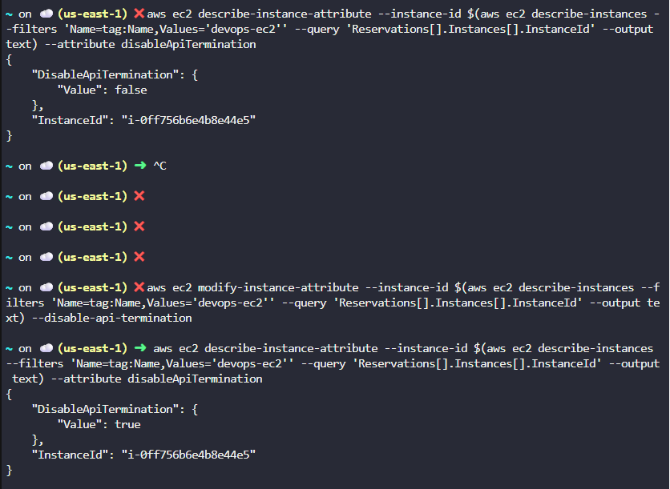

### 1. To obtain the list of EC2 Instance names in the account

```bash
aws ec2 describe-instances \
        --query 'Reservations[*].Instances[*].Tags[*].Value' \
        --output text
```

### 2. There is an EC2 instance name hey-ec2, change the instance from t2.micro to t2.nano

Step 1: Obtain the instance ID
```bash
INSTANCE_ID = $(aws ec2 describe-instances \
                    --filters 'Name=tag:Name,Values=hey-ec2' \
                    --query 'Reservations[*].Instances[*].InstanceId' 
                    --output text)
```

Step 2: Stop the EC2 Instance
```bash
aws ec2 stop-instances \
    --instance-ids $INSTANCE_ID

#wait until it is fully stopped
aws ec2 wait instance-stopped \
    --instance-ids $INSTANCE_ID
```

Step 3: Change the instance type to t2.nano
```bash
aws ec2 modify-instance-attribute \
        --instance-id $INSTANCE_ID \
        --instance-type "Value=t2.nano"
```

### 3. There is an EC2 instance named hey-ec2 under us-east-1 region, enable the stop protection for this instance

Step 1: Check the status of EC2 instance
```bash
aws ec2 describe-instance-attribute \
        --instance-id $(aws ec2 describe-instances \
                            --filters 'Name=tag:Name,Values=hey-ec2' \
                            --query 'Reservations[*].Instances[*].InstanceId' \
                            --output text) --attribute disableApiStop
```

Step2: Enable the stop protection for EC2 instance
```bash
aws ec2 modify-instance-attribute \
        --instance-id $(aws ec2 describe-instances \
                            --filters 'Name=tag:Name,Values=hey-ec2' \
                            --query 'Reservations[*].Instances[*].InstanceId' \
                            --output text) --disable-api-stop
```

### 4. There is an EC2 instance named 'hey-ec2' under us-east-1 region, enable the stop termination protection

Step 1: Check the status of this flag using disableApiTermination
```bash
aws ec2 describe-instance-attribute --instance-id $(aws ec2 describe-instances --filters 'Name=tag:Name,Values='devops-ec2'' --query 'Reservations[].Instances[].InstanceId' --output text) --attribute disableApiTermination
```

Step 2 : Modify the status from false to true.
```bash
aws ec2 modify-instance-attribute --instance-id $(aws ec2 describe-instances --filters 'Name=tag:Name,Values='devops-ec2'' --query 'Reservations[].Instances[].InstanceId' --output text) --disable-api-termination
```


### 5. Attach the elastic IP to the EC2 instance

Step 1: Get the EC2 instance id
```bash
aws ec2 describe-instances --filters "Name=tag:Name,Values=devops-ec2" --query "Reservations[*].Instances[*].InstanceId" --output text --region us-east-1
```

Step 2: Get the allocation ID for elastic IP
```bash
aws ec2 describe-addresses --filters "Name=tag:Name,Values=devops-ec2-eip" --query "Addresses[*].AllocationId" --output text --region us-east-1
```

Step 3: Associate the address
```bash
aws ec2 associate-address --instance-id <INSTANCE_ID> --allocation-id <ALLOCATION_ID> --region us-east-1
```

### 6. Attach the network interface to the EC2 instance

Step 1: Set variables by searching for the Name tags 
```bash
INSTANCE_ID=$(aws ec2 describe-instances --region us-east-1 --filters "Name=tag:Name,Values=datacenter-ec2" --query "Reservations[0].Instances[0].InstanceId" --output text)
ENI_ID=$(aws ec2 describe-network-interfaces --region us-east-1 --filters "Name=tag:Name,Values=datacenter-eni" --query "NetworkInterfaces[0].NetworkInterfaceId" --output text)
```

Step 2: Attach the network interface to device index 1
```bash
aws ec2 attach-network-interface --network-interface-id $ENI_ID --instance-id $INSTANCE_ID --device-index 1 --region us-east-1
```

